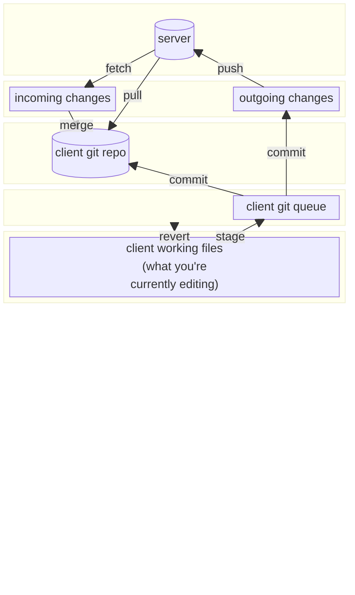

<!-- ```mermaid
flowchart BT
    server[(server)]
    ichanges[incoming changes]
    ochanges[outgoing changes]
    clientw["`client working files
(what you're
currently editing)`"]
    clientg[client git repo]
    clientgq[client git queue]

    server->|pull|clientg
    server->|fetch|ichanges
    ichanges->|pull|clientg

    clientw->|stage changes|clientgq
    clientgq->|commit|clientg
    clientgq->|commit|ochanges

    ochanges->|push|server
``` -->

